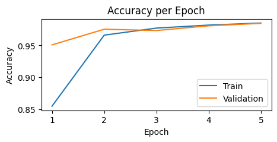
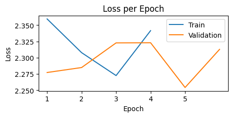
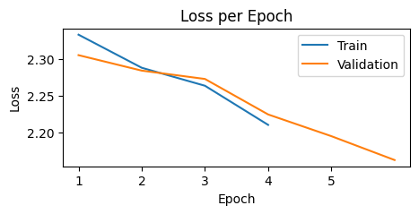
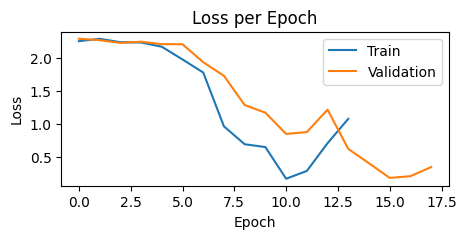

# The Ace of Training Parameters - The Learning Rate
<h4>Exploring the impact of learning rate, how does it work, and balancing out your model's learning ability.</h4>

Computer scientists so as mathematicians has unlocked the ability of our machines to comprehend what do humans see, think, or even comprehend. As humans learn naturally through experience, computers learn through data and some certain parameter setups and  that is why out of the plethora of hyperparameters, we will focus here on learning rate. We call this the ace of training parameters because it controls how much your model learns in the training process.

As defined in the article from Belcic and Stryker from IBM, this governs how much a model adjusts its parameters at each step of its optimization algorithm. To make it sound human, it adjusts how much information you'll be getting through your study session while overthinking whether you'll be passing the test or not. This hyperparameter ensures that your model learns well without under or overcompensating, else your model may learn maybe nothing at all or be too considerate.


*"Bokuto-san, I'm not even your brother."*

Okay, enough of this silly joke with my illustration featuring characters from a volleyball anime franchise but this is simple but complex example if your model learns too much or barely at all. Assuming that you read a government form that asks you for *significant other*, overgeneralizing it means it assumes that this *significant other* is someone who takes care of you, regardless it could be your partner, your best friend, or maybe your neighbor. Under generalizing it means *obviously*, you don't know what it means at all. A good learning rate assumes that this *significant other* is a key person that is related to you, such as your partner, children, or anyone related by blood.

Learning rate parameters usually range from 0.0 to 1.0. A common rule of thumb usually sets that the learning rate should go along with the number of epochs and even the choice of optimizer. Wait... What the heck are epochs and  an optimizer?

<h4>It doesn't work alone!</h4>

Okay, sometimes the learning rate doesn't work itself alone. The number of epochs and the choice of optimizers really do matter in training your model. Epochs sets how many times your model should learn all the information in the dataset that you are training with but setting it costs a warning. Giving it too low causes the model never to converge: it learns too little or nothing at all. Giving it way too high causes it to overfit: meaning, it learns but its limited to what it sees but never generalizes on something new.


*"You just memorized the tax form Bokuto-san... Not the idea of it."*

Okay enough with the other illustration. Optimizers on the other hand, tell the model how it should learn. A good example is the Stochastic Gradient Descent, a variant of the Gradient Descent where its aims to minimize the error iteratively using random samples from small batches rather than the whole dataset. The amount of the given learning rate determines how much steps the optimizer should learn until reaching convergence: meaning, the loss has stabilized or and never further decreases.


*From Gutowska (2025) of IBM. This diagram explains how the learning rate affects the choice of optimizer (SGD in this graph). Lower learning rates show a very steady descent until reaching the point of convergence while higher learning rates show instability, making it difficult to reach convergence. Take note that the choice of optimizer should get along to the learning rate of choice as sometimes, setting it low causes it to learn too slow, higher makes it very unstable.*

<h4>Let's Try it Out!</h4>
We will test out how learning rate affects model convergence by looking at the graph of learning rates and the quality of predictions. We will be using a very small dataset from MNIST and a very simple CNN. You can opt to copy and paste to or rather code along.

```python
# We will import the packages first

import torch
import torch.nn as nn
import torch.nn.functional as F
from torch.utils.data import DataLoader
import torchvision
from torchvision import datasets, transforms

import random
import numpy as np
from sklearn.metrics import confusion_matrix, classification_report, accuracy_score
import matplotlib.pyplot as plt
%matplotlib inline

torch.backends.cudnn.deterministic=True
torch.set_printoptions(sci_mode=False)

import time
from tqdm.notebook import tqdm
```

We'll transform them next into tensors so that it would be comprehensible to our PyTorch library for training.

```python
transform = transforms.ToTensor()

train_data = datasets.MNIST(root='data', train=True, download=True, transform=transform)
test_data = datasets.MNIST(root='data', train=False, download=True, transform=transform)
```

We will split them into train and test sets.

```python
train_set, val_set = torch.utils.data.random_split(train_data, [0.8, 0.2])
```

We set the batch size and dataloaders...

```python
batch_size = 10

train_loader = DataLoader(train_set, batch_size=batch_size, shuffle=True)
val_loader = DataLoader(val_set, batch_size=batch_size, shuffle=True)
test_loader = DataLoader(test_data, batch_size=batch_size, shuffle=False)
```

And make a function that previews our images.
```python
images, labels = iter(train_loader).__next__()

def display_image(batch):
	batch = batch.detach().numpy()
	fig, axs = plt.subplots(1, len(batch), figsize=(12, 2))
	for i in range(len(batch)):
		axs[i].imshow(batch[i, 0, :, :], vmin=0, vmax=1)
		axs[i].axis('off')
		axs[i].set_title(labels[i].numpy())
plt.show()

display_image(images)
```


*Here's a little preview of our images to be trained for our model.*

This is a very rudimentary CNN model made for this dataset with just two convolutional layers. We're just explaining how impactful learning rates are in this case.

```python
class CNN(nn.Module):
	def __init__(self):
		super().__init__()


		self.conv1 = nn.Conv2d(1, 16, kernel_size=3, padding=1)
		self.pool1 = nn.MaxPool2d(2, 2)

		self.conv2 = nn.Conv2d(16, 32, kernel_size=3, padding=1)
		self.pool2 = nn.MaxPool2d(2, 2)

		self.fc1 = nn.Linear(32 * 7 * 7, 128)
		self.fc2 = nn.Linear(128, 10)

	def forward(self, x):
		x = F.relu(self.conv1(x))
		x = self.pool1(x)
  
		x = F.relu(self.conv2(x))
		x = self.pool2(x)

		x = x.view(x.size(0), -1)

		x = F.relu(self.fc1(x))
		x = self.fc2(x)

		return F.log_softmax(x, dim=1)
```

In this first part of our demonstration, we will try out an SGD optimizer with a learning rate of 0.01 (a common learning rate in SGD).

```python
#We'll instantiate the class before we can be able to use it
model = CNN()

#We then set up the criterion and optimizer
criterion = nn.CrossEntropyLoss()
optimizer = torch.optim.SGD(model.parameters(), lr=0.01)
```

Since this is very rudimentary, you can opt to use it on your CPU. If you have a CUDA-enabled GPU, it will take much faster.

```python
device = torch.device('cuda' if torch.cuda.is_available() else 'cpu')

print(device)

model = model.to(device)
```

```python
#Setting up our training and variables to store our training info

epochs = 5
start_time = time.time()
best_acc = 0.0

train_correct = []
train_losses = []
train_accs = []

val_correct = []
val_losses = []
val_accs = []
```

Now copy this code to train it and try running it on your PC or your cloud instance (Let's say Colab or Sagemaker).

```python
for e in range(epochs):
    train_corr = 0
    val_corr = 0

    for train_b, (x_train, y_train) in tqdm(enumerate(train_loader)):
        train_b += 1
        x_train = x_train.to(device)
        y_train = y_train.to(device)

        train_pred = model(x_train)
        train_loss = criterion(train_pred, y_train)

        train_pred_vec = torch.max(train_pred.data, 1)[1] # prediction vector
        train_corr += (train_pred_vec == y_train).sum()

        # Update parameters
        optimizer.zero_grad()
        train_loss.backward()
        optimizer.step()

        if train_b % 1250 == 0:
            print(f"epoch: {e+1:2} | batch: {train_b:4} | instances: [{train_b*batch_size:6} / {len(train_loader)  * batch_size}] | loss: {train_loss.item()}")
            print(f"✅{train_corr.item()} of {train_b*batch_size:2} | accuracy: {round(((train_corr.item() / (train_b*batch_size))) * 100 , 3)}%")

        train_correct.append(train_corr.item())
        train_losses.append(train_loss.item())

    with torch.no_grad():
        for val_b, (x_val, y_val) in enumerate(val_loader):
            val_b += 1

            x_val = x_val.to(device)
            y_val = y_val.to(device)

            val_pred = model(x_val)
            val_pred_vec = torch.max(val_pred.data, 1)[1]
            val_corr += (val_pred_vec == y_val).sum()

            val_loss = criterion(val_pred, y_val)
            val_correct.append(val_corr.item())
            val_losses.append(val_loss.item())

            val_acc = val_corr.item() / (len(val_loader) * batch_size)

        if val_acc > best_acc:
            best_acc = val_acc
           
    train_epoch_acc = train_corr.item() / (batch_size * len(train_loader))
    val_epoch_acc = val_corr.item() / (batch_size * len(val_loader))

    train_accs.append(train_epoch_acc)
    val_accs.append(val_epoch_acc)

print(f'\nDuration: {time.time() - start_time:.0f} seconds')
```

<h4>Let's take a look!</h4>
Given that our parameters are:

| Parameter     | Value                             |
| ------------- | --------------------------------- |
| Learning Rate | 0.01                              |
| Optimizer     | Stochastic Gradient Descent (SGD) |
| Epochs        | 5                                 |
Let us take a look how do the train and accuracy each epoch does work along. Run this code below to take a preview of the accuracy and loss per epoch of our model might look like.

```python
#For Accuracy per Epoch

plt.figure(figsize=(5,2))
plt.plot(train_accs, label="Train")
plt.plot(val_accs, label="Validation")
plt.xlabel("Epoch")
plt.ylabel("Accuracy")
plt.title("Accuracy per Epoch")
plt.legend()
plt.show()
```


*Not much overfitting is shown as it reaching to the last accuracy per epoch and has shown level of convergence.*

```python
#For Loss per Epoch

plt.figure(figsize=(5,2))
plt.plot([train_losses[i-1] for i in range(5000, len(train_losses)+1, 5000)], label="Train")
plt.plot([val_losses[i-1] for i in range(1000, len(val_losses)+1, 1000)], label="Validation")
plt.xlabel("Epoch")
plt.ylabel("Loss")
plt.title("Loss per Epoch")
plt.legend()
plt.show()
```


*An interesting spike at epoch 2, implying that the model was surprised to see something new until stabilizing at later epochs. This is a common quirk on an SGD optimizer.*

Okay, it seems like our model is learning quite well showing a very minimal loss at 0.07 and an accuracy of 98.49% implying that our model with these parameters are trained well! Let's go to the next part where what if...

<h4>The learning rate seems extreme?</h4>
Given the same parameters but the learning rate is 0.5, that would be way too high but let's take a look on how our accuracy and loss curves may look like. To change it, go back to the *optimizer* variable and change the learning rate (*lr*) hyperparameter and set to 0.5.


*Our accuracy score seems terribly low! Let alone it's not even rising or learning at all.*


*Loss also seems higher than our previous setup. Also we notice that the movements of train and validation are at random implying that it doesn't reach convergence or as mentioned earlier, learning anything.*

To put up a simple analogy, a **huge learning rate means you just simply scanned a book without even picking up anything**. Since our ace in the illustration is rushing through his tax forms, he skips through all that information, in which, he is not learning anything...


*"Bokuto-san, you need to read and understand them very carefully... LIKE one step at a time...*

<h4>How about way too low?</h4>

Given the same parameters but the learning rate is 0.0001, that would be very low but let's take a look on how our accuracy and loss curves may look like. To change it, go back to the *optimizer* variable and change the learning rate (*lr*) hyperparameter and set to 0.0001 .


*It's learning anything and rises linearly. But still ending at epoch 5, we see that the accuracy is still quite low.*


*Loss on the other hand, is also decreasing and barely any explosive gradient is observed. We can see that the model is learning slowly, but still not reaching convergence.*

One way we can solve this issue is to increase number of epochs. Let's assume that we set these number of epochs at 15 and let's see how it fares out...


*Increasing epochs with the same learning rate quite helps, improving the learning quality of our model and the model was smoothly learning.*


*Loss on the other hand shows  that it is learning despite some explosive gradients around 12 in validation and 13 in train. However, validation continues to stabilize beyond 15 and in fact still hasn't reached model convergence on our setup.*

This method may help however the time for training would be terribly slow and time consuming. To put this into analogy, **It's like slowly skimming through the details, regardless on how mundane this information is**. Now our ace is told to read this very carefully, he literally took the word carefully by heart. Except... The submission for tax returns are almost due...


*You don't need to read and understand everything on the paper Bokuto-san, just get the idea of what's important. In the property section, write down your condo unit and did you remember how much?*
<h4>To Sum it Up...</h4>
Learning rate is a vital parameter that aids the model's ability to generalize information especially how much information it needs to be able to learn. This parameter does not work alone with the choice of other parameters such as optimizers and epochs. The bottomline here is that there is no default standard parameter for a learning rate especially in dealing much more complex datasets. So set your parameters and the choice of models well. This will ace up your model's capability in generalizing information depending on your use case.

Also, pay your taxes properly!


*"He may not get it right now but at least he submitted the tax forms on time..." - Akaashi, K.*

<h4>If you want to know more...</h4>
Here are some curated articles in relation to this topic!

- [What is learning rate in machine learning? - IBM](https://www.ibm.com/think/topics/learning-rate)
- [What is stochastic gradient descent? - IBM](https://www.ibm.com/think/topics/stochastic-gradient-descent)
- [Optimizers in Deep Learning - Medium](https://musstafa0804.medium.com/optimizers-in-deep-learning-7bf81fed78a0)
- [Epochs in Machine Learning - GeeksforGeeks](https://www.geeksforgeeks.org/machine-learning/epoch-in-machine-learning/)

<h4>References</h4>

- Belcic, I., & Stryker, C. (2025, October 21). _What is learning rate in machine learning?_. IBM. https://www.ibm.com/think/topics/learning-rate

- GeeksforGeeks. (2025, July 23). _Learning rate in neural network_. https://www.geeksforgeeks.org/machine-learning/impact-of-learning-rate-on-a-model/

- Gutowska, A. (2025, October 21). _What is stochastic gradient descent?_. IBM. https://www.ibm.com/think/topics/stochastic-gradient-descent

*Sidenote: Learn ML and read Haikyuu!!*

